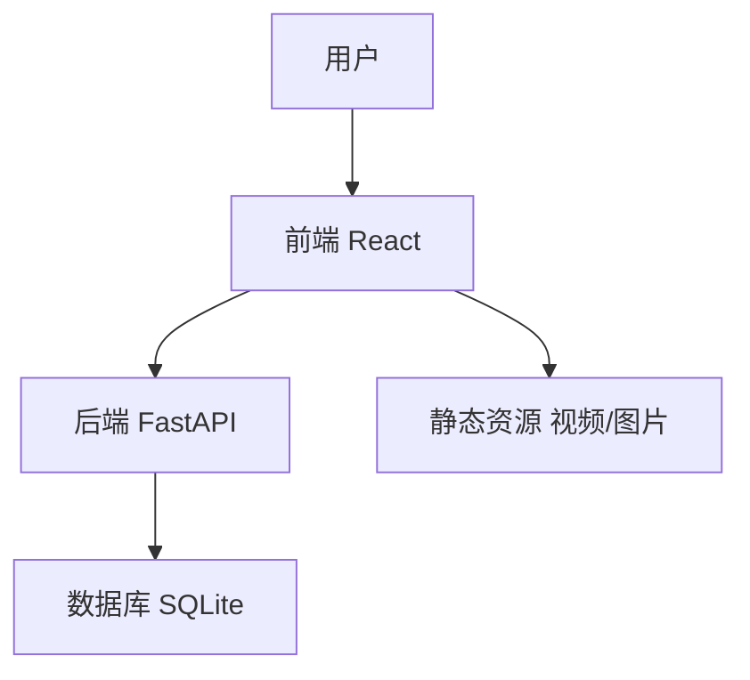
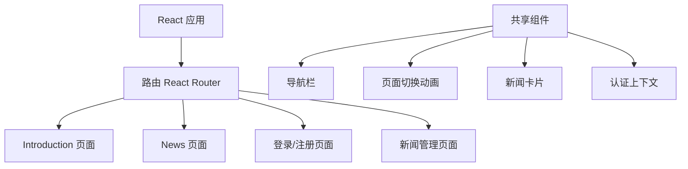
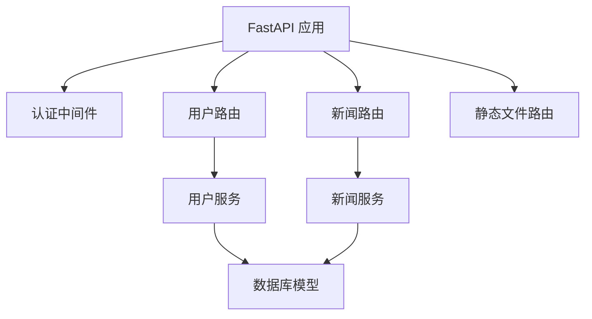

# Feed Music 网站项目计划

## 1. 项目概述

本项目旨在复现类似 feedmusic.com 的网站，包括前端和后端实现。前端使用 React 框架，后端使用 Python + FastAPI，数据库使用 SQLite，认证使用 JWT。

## 2. 需求分析

### 2.1 前端需求

1. **第一屏（Introduction）**
   - 动态背景（自动播放的视频）
   - 文字滚动效果（文字随鼠标滚动，从下往上滚动，文字越滚越大）
   - 顶部导航栏：
     - 分页按钮（Introduction、News）
     - 进度条显示
     - 登录注册按钮
     - 登录后显示用户名和退出登录按钮

2. **第二屏（News）**
   - 响应式网格布局：
     - PC端每行3个新闻卡片
     - 移动端每行1个新闻卡片
   - 新闻卡片内容：
     - 图片
     - 标题（加粗显示）
     - 描述（截断为2行）
     - 创作者标签（等于创建新闻时登录的账号名）
   - "更多"按钮（默认显示两行新闻，点击后多显示一行）

3. **屏幕切换效果**
   - 滚动或导航栏快捷键点击触发
   - 复现参考网站的切换效果

4. **响应式设计**
   - 媒体查询适应不同设备
   - 调整布局和字体大小

### 2.2 后端需求

1. **用户系统**
   - 功能：注册、登录、登出
   - 数据存储：用户名、加密密码、邮箱
   - 权限控制：未登录用户禁止访问后台

2. **新闻管理后台**
   - 功能：
     - 创建新闻（标题、描述、图片上传/URL）
     - 编辑/删除已有新闻
     - 列表分页展示
   - 数据关联：每条新闻记录创建者（绑定用户名）

## 3. 系统架构设计

### 3.1 整体架构



### 3.2 前端架构



### 3.3 后端架构



## 4. 数据库设计

### 4.1 用户表（Users）

| 字段名 | 类型 | 说明 |
|--------|------|------|
| id | INTEGER | 主键，自增 |
| username | TEXT | 用户名，唯一 |
| email | TEXT | 邮箱，唯一 |
| password | TEXT | 加密密码 |
| created_at | TIMESTAMP | 创建时间 |

### 4.2 新闻表（News）

| 字段名 | 类型 | 说明 |
|--------|------|------|
| id | INTEGER | 主键，自增 |
| title | TEXT | 新闻标题 |
| description | TEXT | 新闻描述 |
| image_url | TEXT | 图片URL |
| creator_id | INTEGER | 外键，关联用户表 |
| created_at | TIMESTAMP | 创建时间 |
| updated_at | TIMESTAMP | 更新时间 |

## 5. API 接口设计

### 5.1 用户相关接口

#### 5.1.1 注册

- **URL**: `/api/users/register`
- **方法**: POST
- **请求体**:
  ```json
  {
    "username": "string",
    "email": "string",
    "password": "string"
  }
  ```
- **响应**:
  ```json
  {
    "id": "integer",
    "username": "string",
    "email": "string",
    "created_at": "string"
  }
  ```

#### 5.1.2 登录

- **URL**: `/api/users/login`
- **方法**: POST
- **请求体**:
  ```json
  {
    "username": "string",
    "password": "string"
  }
  ```
- **响应**:
  ```json
  {
    "access_token": "string",
    "token_type": "string",
    "user": {
      "id": "integer",
      "username": "string",
      "email": "string"
    }
  }
  ```

#### 5.1.3 登出

- **URL**: `/api/users/logout`
- **方法**: POST
- **请求头**: Authorization: Bearer {token}
- **响应**:
  ```json
  {
    "message": "Successfully logged out"
  }
  ```

#### 5.1.4 获取当前用户信息

- **URL**: `/api/users/me`
- **方法**: GET
- **请求头**: Authorization: Bearer {token}
- **响应**:
  ```json
  {
    "id": "integer",
    "username": "string",
    "email": "string",
    "created_at": "string"
  }
  ```

### 5.2 新闻相关接口

#### 5.2.1 获取新闻列表

- **URL**: `/api/news`
- **方法**: GET
- **查询参数**:
  - page: 页码，默认1
  - limit: 每页数量，默认6
- **响应**:
  ```json
  {
    "items": [
      {
        "id": "integer",
        "title": "string",
        "description": "string",
        "image_url": "string",
        "creator": {
          "id": "integer",
          "username": "string"
        },
        "created_at": "string",
        "updated_at": "string"
      }
    ],
    "total": "integer",
    "page": "integer",
    "limit": "integer",
    "pages": "integer"
  }
  ```

#### 5.2.2 获取单个新闻

- **URL**: `/api/news/{id}`
- **方法**: GET
- **响应**:
  ```json
  {
    "id": "integer",
    "title": "string",
    "description": "string",
    "image_url": "string",
    "creator": {
      "id": "integer",
      "username": "string"
    },
    "created_at": "string",
    "updated_at": "string"
  }
  ```

#### 5.2.3 创建新闻

- **URL**: `/api/news`
- **方法**: POST
- **请求头**: Authorization: Bearer {token}
- **请求体**:
  ```json
  {
    "title": "string",
    "description": "string",
    "image_url": "string"
  }
  ```
- **响应**:
  ```json
  {
    "id": "integer",
    "title": "string",
    "description": "string",
    "image_url": "string",
    "creator": {
      "id": "integer",
      "username": "string"
    },
    "created_at": "string",
    "updated_at": "string"
  }
  ```

#### 5.2.4 更新新闻

- **URL**: `/api/news/{id}`
- **方法**: PUT
- **请求头**: Authorization: Bearer {token}
- **请求体**:
  ```json
  {
    "title": "string",
    "description": "string",
    "image_url": "string"
  }
  ```
- **响应**:
  ```json
  {
    "id": "integer",
    "title": "string",
    "description": "string",
    "image_url": "string",
    "creator": {
      "id": "integer",
      "username": "string"
    },
    "created_at": "string",
    "updated_at": "string"
  }
  ```

#### 5.2.5 删除新闻

- **URL**: `/api/news/{id}`
- **方法**: DELETE
- **请求头**: Authorization: Bearer {token}
- **响应**:
  ```json
  {
    "message": "News deleted successfully"
  }
  ```

## 6. 前端组件设计

### 6.1 页面组件

1. **App.js**: 主应用组件，包含路由和全局状态
2. **IntroductionPage.js**: 第一屏页面
   - VideoBackground: 视频背景组件
   - ScrollText: 滚动文字组件
3. **NewsPage.js**: 第二屏页面
   - NewsGrid: 新闻网格组件
   - NewsCard: 新闻卡片组件
   - LoadMoreButton: 加载更多按钮
4. **LoginPage.js**: 登录页面
5. **RegisterPage.js**: 注册页面
6. **NewsManagementPage.js**: 新闻管理页面
   - NewsForm: 新闻表单组件
   - NewsList: 新闻列表组件

### 6.2 共享组件

1. **Navbar.js**: 导航栏组件
   - NavButton: 导航按钮组件
   - ProgressBar: 进度条组件
   - AuthButtons: 认证按钮组件
2. **PageTransition.js**: 页面切换动画组件
3. **AuthContext.js**: 认证上下文组件
4. **ProtectedRoute.js**: 受保护路由组件

## 7. 项目实施计划

1. **项目初始化**
   - 设置前端项目结构
   - 设置后端项目结构
   - 配置数据库

2. **后端实现**
   - 实现数据库模型
   - 实现用户认证系统
   - 实现新闻管理功能
   - 实现API接口

3. **前端实现**
   - 实现共享组件
   - 实现Introduction页面
   - 实现News页面
   - 实现登录/注册页面
   - 实现新闻管理页面

4. **集成与测试**
   - 前后端集成
   - 功能测试
   - 响应式设计测试
   - 性能优化

5. **部署**
   - 准备部署文档
   - 部署说明

## 8. 技术栈

### 8.1 前端

- React
- React Router
- Axios
- SCSS/CSS Modules
- React Context API (状态管理)

### 8.2 后端

- Python
- FastAPI
- SQLite
- SQLAlchemy
- Pydantic
- Python-Jose (JWT)
- Passlib (密码加密)

## 9. 项目目录结构

```
feed_music/
├── backend/
│   ├── app/
│   │   ├── __init__.py
│   │   ├── main.py
│   │   ├── config.py
│   │   ├── database.py
│   │   ├── models/
│   │   │   ├── __init__.py
│   │   │   ├── user.py
│   │   │   └── news.py
│   │   ├── schemas/
│   │   │   ├── __init__.py
│   │   │   ├── user.py
│   │   │   └── news.py
│   │   ├── api/
│   │   │   ├── __init__.py
│   │   │   ├── deps.py
│   │   │   ├── users.py
│   │   │   └── news.py
│   │   ├── core/
│   │   │   ├── __init__.py
│   │   │   ├── security.py
│   │   │   └── config.py
│   │   └── static/
│   │       ├── images/
│   │       └── uploads/
│   ├── requirements.txt
│   └── README.md
├── frontend/
│   ├── public/
│   │   ├── index.html
│   │   ├── favicon.ico
│   │   └── assets/
│   │       ├── videos/
│   │       └── images/
│   ├── src/
│   │   ├── App.js
│   │   ├── index.js
│   │   ├── assets/
│   │   │   ├── styles/
│   │   │   └── images/
│   │   ├── components/
│   │   │   ├── common/
│   │   │   │   ├── Navbar.js
│   │   │   │   ├── PageTransition.js
│   │   │   │   └── ProtectedRoute.js
│   │   │   ├── Introduction/
│   │   │   │   ├── VideoBackground.js
│   │   │   │   └── ScrollText.js
│   │   │   └── News/
│   │   │       ├── NewsGrid.js
│   │   │       ├── NewsCard.js
│   │   │       └── LoadMoreButton.js
│   │   ├── contexts/
│   │   │   └── AuthContext.js
│   │   ├── pages/
│   │   │   ├── IntroductionPage.js
│   │   │   ├── NewsPage.js
│   │   │   ├── LoginPage.js
│   │   │   ├── RegisterPage.js
│   │   │   └── NewsManagementPage.js
│   │   ├── services/
│   │   │   ├── api.js
│   │   │   ├── auth.js
│   │   │   └── news.js
│   │   └── utils/
│   │       ├── helpers.js
│   │       └── constants.js
│   ├── package.json
│   └── README.md
└── README.md